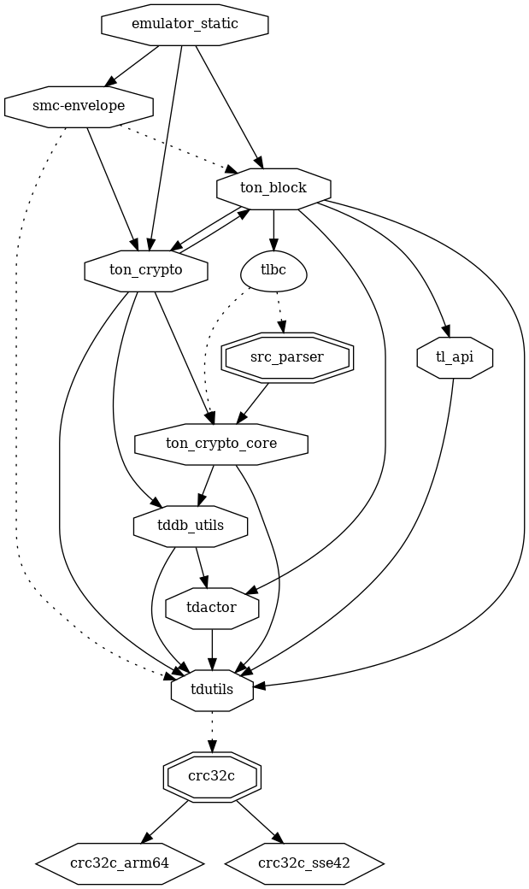

# Emulator

Emulator is a shared library containing the following functionality:
- Emulating blockchain transactions
- Emulating TVM - get methods and sending external and internal messages.

## Transaction Emulator

To emulate transaction you need the following data:

- Account state of type *ShardAccount*.
- Global config of type *(Hashmap 32 ^Cell)*.
- Inbound message of type *MessageAny*.

Optionally you can set emulation parameters:
- *ignore_chksig* - whether CHKSIG instructions are set to always succeed. Default: *false*
- *lt* - logical time of emulation. Default: next block's lt after the account's last transaction block.
- *unixtime* - unix time of emulation. Default: current system time
- *rand_seed* - random seed. Default: generated randomly
- *libs* - shared libraries. If your smart contract uses shared libraries (located in masterchain), you should set this parameter.

Emulator output contains:
- Transaction object (*Transaction*)
- New account state (*ShardAccount*)
- Actions cell (*OutList n*)
- TVM log

## TVM Emulator

TVM emulator is intended to run get methods or emulate sending message on TVM level. It is initialized with smart contract code and data cells. 
- To run get method you pass *initial stack* and *method id* (as integer).
- To emulate sending message you pass *message body* and in case of internal message *amount* in nanograms.

## emulator

## emulator_static

### emulator_static dependers

